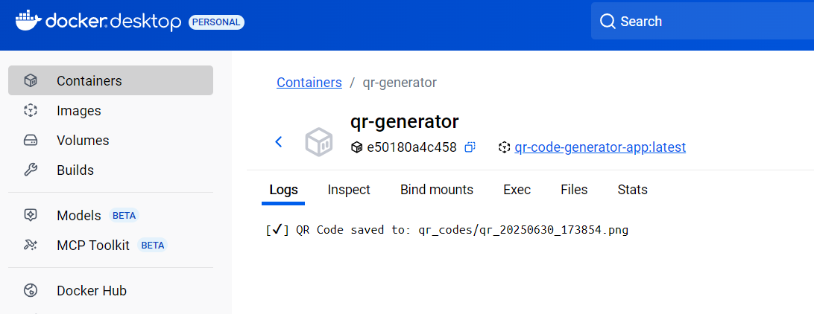
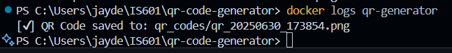
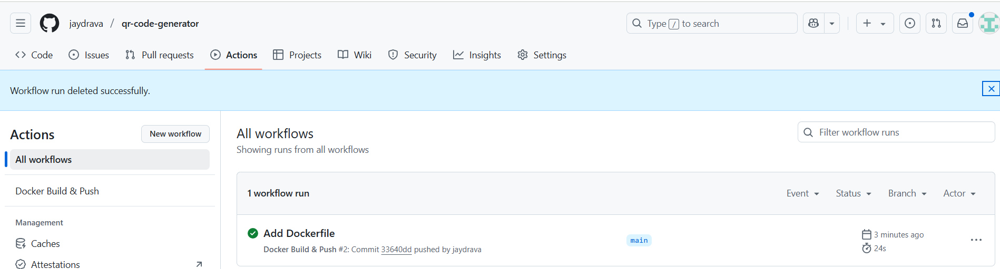

# QR Code Generator - Dockerized Application

** Student: ** Jaydrava
** Course: ** IS601
** Assignment: ** Module 7 - Dockerizing the QR Code Generator Application
** Date: ** June, 30 2025

## 🔗 Submission Links
    ** GitHub Repository: ** https://github.com/jaydrava/qr-code-generator
    ** DockerHub Image: ** https://hub.docker.com/r/jaydrava/qr-code-generator-app

## 📦 About the project

This project is a QR Code Generator written in Python. It accepts a URL and generates a QR code image stored in a 'qr_codes' folder.

The application has been:
 - Dockerized with a secure and minimal base image
 - Built and pushed to DockerHub
 - Executed in a container with volume mounting
 - Connected to GitHub Actions for CI/CD

## Docker Instructions

### Build the Docker Image

    docker build -t qr-code-generator-app

### Run the Container

    docker run -d --name qr-generator qr-code-generator-app

### View Container Logs

    docker logs qr-generator

✅ GitHub Actions CI/CD

    - GitHub Actions workflow in .github/workflows/docker.yml
    - It build Docker image and ensure Dockerfile integrity
    - Credentials are saved securely using GitHub repository secrets

📷 Screenshots

 
 
 

## Reflection

    - Understand and write Dockerfile
    - Use secure practices like non-root users and volume mounts
    - Tag and push Docker images to DockerHub
    - Configure GitHub Actions to build Docker images using secrets


- ## Challenges I faced:

    - Import issues due to missing PIL module
    - Setting up GitHub Secrets for DockerHub login
    - Understanding volume mount paths in Windows

- ## Improvements I'd like to make:

    - Add automated QR output verification in CI
    - Extend the app to accept user input dynamically

## Project Structure

```bash

qr-code-generator/
├── Dockerfile
├── main.py
├── requirements.txt
└── .github/
    └── workflows/
        └── docker.yml

```

